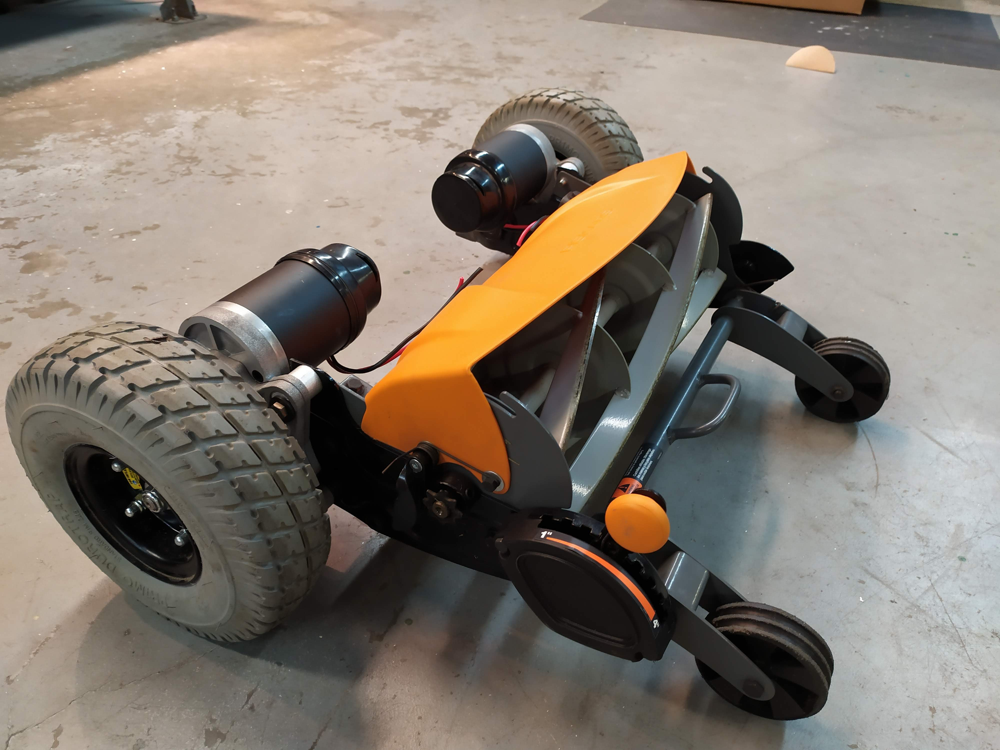
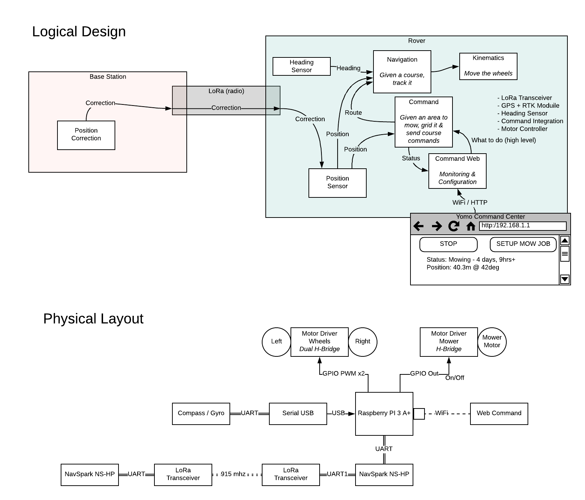

# yomo
Autonomous solar-only lawn trimming rover

# WHY?!

I want a 100% autonimous non-stupid set-it-forget-it bulk grass cutting device that I didn't have to babysit, watch, push, tow or remote into.  Setup the parimeter and let it do its thing so long as the sun is shining and the good Lord is willing!

# Technology

- Old beat up Power Chair, preferably without batteries.
- ~~Two Hedge Trimmers; I may evaluate reel mowers too, they cut better (on short, frequently cut grass) and use about the same energy~~
- Purchased and converted a Reel Mower
- Raspbery Pi 3 A+ main board
- ~~Adafruit GPS HAT~~ (I need cm accuracy, regular GPS won't cut it[ouch])
- 2x NavSpark DGPS receievers
- 2x Long ranage 915mhz trasmitter/receiver modules
- 3x H-Bridge to power the motors

# Design

This is the logical and physical layout of the components

[Detailed Design](Design.md)

[The implimenation specification](Implimentation.md) details the hardware/software compontents that will make-up the rover and how/what technology they will be built on.

# Steps

## Failures
- Hedge trimmers suck for cutting grass
- You don't need a power chair to have a mower, just the motors

## Current Status
- Fully architected, designed & UX mock-up (see this repo)
- Mounted the power chair motors very slickly on the reel mower (I tied into the existing bolts in the side rails)
- Written much of the control system (Navigation, Kinematics and much of the configuration)
- Aseembled and Setup the DGPS recievers (worked exactly like youtube)
- Started writing Ops web page

## Next
- 6/29 - Start testing the components I've written
- 6/30 - Assemble the H-Bridge and wire to proto board hat to the raspberry pi.
- 6/30 - Finish writing Ops web page that will command robot in manual mode and configure regions
- 7/10 - Finish the mower hardware; add the reel driver motor (it has arrived).  This will be the last thing

## RTK GPS

Getting a hyper accurate position sensor is really the key to this project actually working at all.  After a lot of searching I found an  inexpensive RTK GPS setup with good instructional videos and great documentation (not entirely Chineese, so really good).  It's modules only, so there's manual setups and configurations and it needs a seperate LoRa transciever to sync the sat offset data.  But the chips do all the real work and the project gets 1cm accuracy.

The whole RTK setup cost ~$250.  Next cheapest "hobby grade" is $600; after that it goes up steaply.  $1500 for the first shrink wrap solution then sky is the limits for survey stuff (2k-5k). 

6/27 UPDATE: I had some bother setting up my own USB-UART dongle (not the one they sell). Once I sorted those issue out the NavStar RTK GPS setup _EXACTLY_ like the video, very impressive, very straight forward.  I haven't tested the correction serial links yet, but I'll get those in soon.

Watch this video:
[NavSpark Overview/Setup video](https://www.youtube.com/watch?v=17fS9YZC84I)

Source:
[NavSpark Store](http://navspark.mybigcommerce.com/)
